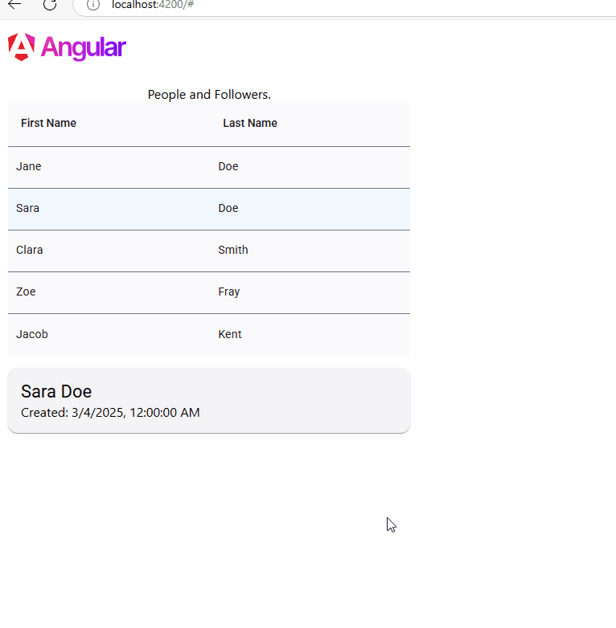

# Followers

A tutorial project for displaying users and their followers, developed in ASP .NET Core Web API and Angular.



## Summary

This project demonstrates creating a full-stack web application using ASP .NET Core Web API for the backend service with Angular and Material Design for the frontend client. The application displays an SQLite database of people and their followers. A person can follow another person, which is displayed upon selecting a name from the list.

## Quick Start

### Prerequisites
- .NET 6.0 SDK or later
- Angular CLI

### Backend Setup
1. Navigate to the backend project directory:
    ```sh
    cd /Service
    ```
2. Restore the dependencies:
    ```sh
    dotnet restore
    ```
3. Run the backend service:
    ```sh
    dotnet run
    ```
4. Open your browser and navigate to the Swagger API explorer `http://localhost:5122/swagger`.

### Frontend Setup
1. Navigate to the frontend project directory:
    ```sh
    cd /Client
    ```
2. Install the dependencies:
    ```sh
    npm install
    ```
3. Run the frontend application:
    ```sh
    ng serve
    ```
4. Open your browser and navigate to `http://localhost:4200`.

## API Methods

### Get All Followers
- **Endpoint:** `GET /api/follower`
- **Description:** Retrieves a list of all followers.
- **Parameters:** `includeDetails` (optional) - boolean to include detailed information.

### Get Followers by Person ID
- **Endpoint:** `GET /api/follower/{personId}`
- **Description:** Retrieves a list of followers for a specific person.
- **Parameters:** `personId` - GUID of the person.

### Add a Follower
- **Endpoint:** `POST /api/follower`
- **Description:** Adds a new follower.
- **Body:** 
    ```json
    {
        "followerId": "GUID",
        "followeeId": "GUID"
    }
    ```

### Remove a Follower
- **Endpoint:** `DELETE /api/follower/{id}`
- **Description:** Removes a follower by ID.
- **Parameters:** `id` - GUID of the follower.

### Get All People
- **Endpoint:** `GET /api/person`
- **Description:** Retrieves a list of all people.
- **Parameters:** `id` - GUID of the follower.

### Get Person by ID
- **Endpoint:** `GET /api/person/{id}`
- **Description:** Retrieves a person by id.
- **Parameters:** `id` - GUID of the person.

### Add a Person
- **Endpoint:** `POST /api/person`
- **Description:** Adds a new person.
- **Body:** 
    ```json
    {
    "id": "GUID",
    "createDate": "2025-03-05T22:02:08.711Z",
    "firstName": "Alice",
    "lastName": "Doe"
    }
    ```

## Tech-Stack
- **Backend:** ASP .NET Core Web API, Entity Framework, SQLite
- **Frontend:** TypeScript, Angular, Material Design

## License

MIT

## Author

Kory Becker
https://primaryobjects.com